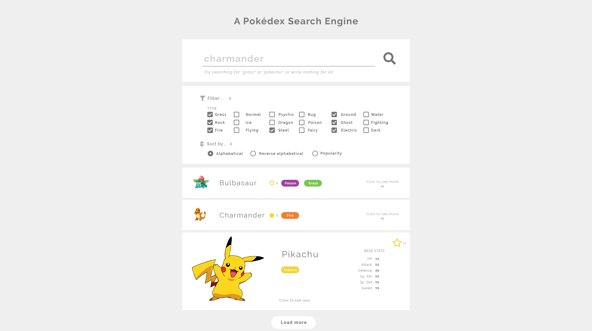

# Pokédex

> Gruppe 1 - Project 4 - IT2810 Webutvikling H18



## Getting started

### Setting up

Clone the project and install dependencies as such:

```sh
$ git clone git@gitlab.stud.idi.ntnu.no:it2810-h18/prosjekt3/gruppe01.git
$ cd gruppe01
$ yarn
```

Or if you're not using ssh

```sh
$ git clone https://gitlab.stud.idi.ntnu.no/it2810-h18/prosjekt3/gruppe01.git
$ cd gruppe01
$ yarn
```

### Useful scripts

In the project directory, you can run:

#### `yarn start`

Runs the app in the development mode. Open [http://localhost:3000](http://localhost:3000) to view it in the browser.

The page will reload if you make edits. You will also see any lint errors in the console.

#### `yarn test`

Launches the test runner in the interactive watch mode. Runs all the `Jest` tests.

#### `yarn build`

Builds the app for production to the `build` folder. It correctly bundles React in production mode and optimizes the build for the best performance.

#### `yarn cypress:open`

Opens the cypress window where you can select a cypress tests to run

## What our site does

Pokedex, search for type or name of pokemon.

## Teamwork

Lorem ipsum ...

### Git

Issues... Assigning, user stories, sub tasks, labelling, referencing issues.

In our previous project we tried using a dev branch to replace our master branch
until we were ready to hand it, but we decided against it for this project.
This was due to the findings that while it might be useful in a bigger project,
and we wanted to try it out, it was rather a small hindrance in such a small
project, and due to not having several releases of our app, were not able to
take advantage of it's good points.

## This project was built with...

Built using React, Redux, Relay(?) (or Apollo client), Express, Node, MySQL.
Use of pagination.

What happens when you search...

### Project structure

Lorem ipsum ...

### Content of app

We got our data for the database of the pokedex from ...

### React

Lorem ipsum ...

### Redux

Lorem ipsum ...

### AJAX

### GraphQL

### Relay (GraphQL)

Lorem ipsum ...

### Express

Lorem ipsum ...

### Fontawesome's official React component for icons

[Read how to get started with using Fontawesome icons with React here](https://fontawesome.com/how-to-use/on-the-web/using-with/react)

## Testing

In this project we tested in several ways using `Jest`, `Cypress` and manual testing.

### Jest

Lorem ipsum ...

### Cypress

Lorem ipsum ...

### Manual testing

Lorem ipsum ...
