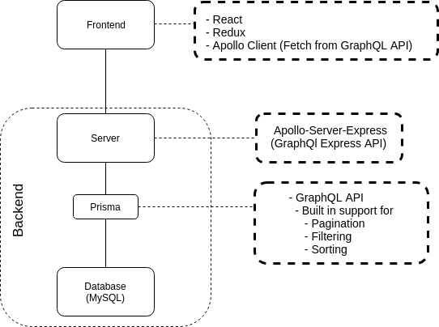

# Pokédex

> Gruppe 1 - Project 4 - IT2810 Webutvikling H18


## What our site does

We wanted to make a Pokédex, where it is possible to search, filter and sort pokemon. Additionally the user can “star” a pokemon, which will increase the number of stars associated to this pokemon in the database. In the list of search results, it is possible to get a more detailed view of the pokemon, by showing its base stats. Initially only the first 5 results are shown, and more results can be loaded by pressing “load more”.

In the future we would have liked to expand the data set, as we only have 24 pokemon at the time, and added the possibility for even more filters, and also more details about each pokemon. But as this is a prototype, we are very pleased with the current result as it is sufficient to demonstrate the technologies used. The GitLab repo also has several enhancement issues which describes what would be fixed given the time.

## Getting started

Running the backend of this project requires [docker](https://docs.docker.com/install/linux/docker-ce/ubuntu/#install-docker-ce) and [docker-compose](https://docs.docker.com/compose/install/), so go ahead and install those if you want to run the project locally.

### Setting up

We have used `yarn`, but you may use `npm` instead with the equivalent commands. Clone the project and install dependencies as such:

```sh
$ git clone git@gitlab.stud.idi.ntnu.no:it2810-h18/prosjekt3/gruppe01.git
# or if not using ssh $ git clone https://gitlab.stud.idi.ntnu.no/it2810-h18/prosjekt3/gruppe01.git
$ cd gruppe01
$ yarn # install the project dependencies
$ cd database && docker-compose up -d # Sets up and hosts the database api at http://localhost:4466/
$ yarn server:dev # You need to run the backend to be able to populate the database with our script
$ sudo npm install -g graphql-cli # Needed as prisma deploy uses this in our setup
$ yarn prisma deploy # Create the tables in the database and migrate model
$ node populate_database.js # Populates the database
```

Then you can run project with `yarn server:dev` in one tab and `yarn start` in the other and go to [localhost:3000](http://localhost:3000) to view the app.

### Useful scripts

In the project directory, you can run:

#### `yarn start`

> If you get an error mentioning that a module cannot be found, use the following command instead:
> `NODE_PATH=src/ && yarn start`
> This error happens because on some machines the configuration that gives us absolute imports is not being set correctly, and you need to manually set the config in your terminal.

Runs the app in the development mode. Open [http://localhost:3000](http://localhost:3000) to view it in the browser.

The page will reload if you make changes to the project. You will also see any lint errors in the console.

#### `yarn server:dev`

Run the GraphQL development server. To see the interactive API (the playground), go to [http://localhost:4000/graphql](http://localhost:4000/graphql). There you can see the documentation for the API and interact with it.

#### `yarn cypress:open`

Opens the cypress window where you can select a cypress tests to run, or run all by clicking `run all specs`

#### `yarn graphql playground --port=3500`

Allows you to see the playground of both the database API and our project api in the same window, which can be useful in development. The port flag is only used due to it running by default on port 3000, which clashes with the frontend, so this flag is only needed if running both. To use this command without “yarn requires that you have `graphql-cli` installed globally on your computer.

```sh
$ npm install -g graphql-cli
```

#### `yarn prisma deploy`

If making changes to the database model in `database/datamodel.prisma`, you need to run this command afterwards. After deploying the new model, it automatically
updates the schema that is used by our server for database queries. Using this command without “yarn” requires that `prisma` is globally installed on your computer.

```sh
$ npm install -g prisma
```

#### `yarn prisma reset`

Reset/Empty the database. Using this command without “yarn” requires that `prisma` is globally installed on your computer.

```sh
$ npm install -g prisma
```

#### `yarn build`

Builds the app for production to the `build` folder. It correctly bundles React in production mode and optimizes the build for the best performance.

## Planning and starting the Project

To start off the project, we started by looking through the requirements, finding ideas for what we could make, and deciding on an idea. Then we planned what functionality our product would have to ensure we covered all the requirements, and then making a design sketch to use as a reference. We quickly set up our issue board, with labels and issues we knew we needed to cover. Once we had that we continued by setting up "Hello worlds" for all the tools we would use, and implemented a dummy implementation of the design. As we got along with the project we added more issues as the need arose.

## Project structure

We have split our React components into the folders “components” and “containers”, based on the pattern suggested by Dan Abramov where he talks about separating presentational components from logic and state as much as possible:  
[Dan Abramov on smart & dumb components](https://medium.com/@dan_abramov/smart-and-dumb-components-7ca2f9a7c7d0)

The other project files are located as follows:

- Cypress tests can be found in `cypress/integration`
- Illustrations for this readme can be located in `documentation-visuals`
- Database files and dataset are located in `database`
- Server and schema can be found in `server`
- Redux actions and reducers are placed in `actions` and `reducers` respectively
- Pokemon types constants are located in `constants`
- GraphQL queries are put in `queries`

Our data set is relatively small (24 elements), because we had difficulty finding a JSON file containing exactly the info we wanted. Thus we did some manual work to make it instead as we found out it would be less time consuming than searching for the perfect data set. In the future this would have been expanded to include all the generations of pokemon.

## Technology

See below for a structured overview over the different technologies, and how they are connected.



### React

The project is made using React, using ES6 syntax, and has been set up with create-react-app.

### Redux

Redux is a predictable state container for JavaScript apps, which simplifies state handling by gathering all of the app-state in one place, the Redux store. Redux has no connection to React, but works especially well with it. On how to use Redux with your React app, read more here: [https://redux.js.org/basics/usagewithreact](https://redux.js.org/basics/usagewithreact)

By using Redux we enable our components to affect and read the state used in different parts of the app, allowing us to implement app-wide functionality in a quick, clean and effective manner.

#### Redux forms

Redux forms advertises as being “The best way to manage your form state in Redux.” We have used it to make our form data available through our Redux state, and it was very simple to set up with a lot of examples and documentation available. We have used Redux form in `containers/SearchForm` to create our search bar, filter, and sorting components.

Read more on [https://redux-form.com/](https://redux-form.com/]

### AJAX

We have used the Fetch API directly handle asynchronous fetching in `populate_database.js`. We have used async/await which comes with ES7 in our server, in `schema.js`.

### Express

Express is a middleware framework that will take an incoming request and produce an output that can be the final output or could be passed on to another middleware function. We integrate Express using Apollo Server to create our GraphQL API (see below for more info on GraphQL). Using express through Apollo Server simplifies the setup and requires less boilerplate.

### GraphQL

GraphQL is a new alternative to the traditionally used REST, but it could also used together with REST endpoints. GraphQL is based on the idea of having one smart endpoint, as opposed to multiple dumb endpoints as is the case with REST. It does not come without its weaknesses, so read up and make an educated decision on what to choose for your application.

GraphQL lives in the layer between the frontend clients and the databases. It enables apps to get specific data from one, or multiple, databases without specifically having to set up a dedicated endpoint for that purpose. You can ask very specifically for only the data you need to use. By doing this we avoid fetching of redundant data, and set up of redundant endpoints. We implemented GraphQL with [Apollo](https://www.apollographql.com/).

Read more about the benefits of GraphQL here: [https://graphql.org/](https://graphql.org/)

#### GraphQL client

We integrated GraphQL into our webapp using the Apollo Client framework for React. This framework makes it easy for us to use GraphQL in frontend, as it provides good wrapper components for queries and mutations, handles caching, and gives us tools like `fetchMore` for handling pagination easier.

Read more about it here:.
[https://www.apollographql.com/client](https://www.apollographql.com/client)
and [apollo used with react](https://www.apollographql.com/docs/react/)

#### GraphQL server

For implementing our server we used Apollo Server in combination with their extension for Express. GraphQL in combination with Apollo Server allowed us to quickly build a self-documenting API for our Apollo Clients. It also comes with an interactive playground with autocompletion and documentation, where you can interact with your API, and create and test queries before adding them to your application. The schema, which is where we define what you can do with the endpoint and how the server handles the request, consists of `typeDefs` and `resolvers`.

GraphQL is strongly typed, which it follows from that all the types of variables have to be defined. This makes GraphQL a lot more powerful, since it can give very concrete error messages, and not just “Bad request”, but for example tells you that it expected a String for that argument, but recieved e.g. an Integer, aiding your debugging process, and if you’re missing an argument, it tells you which.

Read more about Apollo Server here:
[apollo-server docs](https://www.apollographql.com/docs/apollo-server/)
and [apollo-server-express](https://www.apollographql.com/docs/apollo-server/servers/express.html)

##### TypeDefs

`typeDefs` is where you define your API. This is where you define what queries you can make, what they require and what they return to the user. This is what GraphQL uses to create the documentation for the API automatically and uses to determine if a query is vaild or not, syntactically.

GraphQL has some built in types like, strings and integers, but to enhance our API and make use of the benefits of GraphQL’s strong typing, we added two more. One being all the pokemon types you have available, called `Type`, and one for the sorting methods available, called `PokemonOrderByInput`. `PokemonOrderByInput` is copied from Prisma’s (more on Prisma below) autogenerated schema for sorting methods it use on the database, and allows for more functionality than we have made use of in our frontend.

##### Resolvers

`resolvers` is where you say how the server should respond to a query to the api, and this could be simply returning a string like “Hello World”, or fetching data from the database (which we connect to and query through Prisma).

#### Prisma

Prisma is the layer between the database and the server. Prisma grants us simplified database access through its powerful features, including sorting, filtering and pagination. (Though we had to custom make filtering and pagination to some degree due to some unsupported queries.)

Read more about Prisma here:
[https://www.prisma.io/with-graphql](https://www.prisma.io/with-graphql)

### Docker

> “Docker is a tool designed to make it easier to create, deploy, and run applications by using containers. Containers allow a developer to package up an application with all of the parts it needs, such as libraries and other dependencies, and ship it all out as one package.” [source](https://opensource.com/resources/what-docker)

We used Docker to setup Prisma and the MySQL database, as this was part of the setup of Prisma. The database is set up with docker using a MySQL docker image. We used the docker-compose file as a script to set up our database with docker, both for our local development, and as our production database on the virtual machine.

Read more about it here:
[docker](https://www.docker.com/) and [prisma and databases](https://www.prisma.io/docs/reference/prisma-servers-and-dbs/prisma-servers/docker-aira9zama5)

### Cypress

Cypress is a JavaScript framework for end to end testing. Cypress hugely simplifies the testing process and was very pleasant and intuitive in use. The framework includes a GUI where tests can be run, and visualises the tests in a browser while running. Read more about how it works here: [https://www.cypress.io/how-it-works/](https://www.cypress.io/how-it-works/)

### Jest

Jest is a zero configuration testing platform for testing JavaScript code. This also includes React applications. It automatically runs files in `__test__`folders, files that end with `spec.js` and files that end with `test.js`. Jest supports testing of asynchronous code, UI snapshot testing and testing using mockups.

## Implementation of main functionality

The main functionality for our App is sorting, filtering, searching through and mutating the dataset in our database, and implementing pagination.

### Pagination

There are mainly two ways pagination is implemented: Cursor based and offset based. As our dataset is static we implemented an offset based pagination since the implementation is usually simpler. Our frontend handles the selection of offset-indexes, while our backend simply returns the correct pokémon based on these offsets. When implementing offset based pagination it’s important to be vary of duplicating or skipping data entries in the database.

As our filtering is custom written, we had to implement a custom implementation of offset based pagination. This is done through the `pagination`-function. By customizing our pagination implementation we are able to paginate the whole dataset seamlessly regardless of selected filters.

By using the Apollo GraphQL `fetchMore`-function we are automatically caching already-fetched data in the frontend client.

We misinterpreted the requirement in our implementation, which was either page based pagination or infinite scrolling. Our pagination method comes in between those two. It's not purely page based pagination as you cannot navigate through pages of pokemon, but instead you click on "Load more", so that it merges one "page" with the next. We would have implemented infinite scrolling given the time, as that would give the nicest user experience for this application, but we ended up with not having the time to complete it.

### Sorting

Sorting is handled through the Prisma API by using the `orderBy` argument in the server side queries.

### Filtering

We had to add our own implementation of filtering due to a lack of support for filtering through lists in the Prisma API. Our filtering method input arguments are a list of filters to apply, and a collection of data to apply them too. If the list of filters is empty, the function returns the unfiltered collection. This is done in the `filterPokemonType`-function.

### Search

Search is handled through the Prisma API by using the `name_contains` argument in the server side queries.

### Posting (mutating db)

One requirement for this project was to allow for a user to mutate the database in some way. We have solved this by adding two mutations to our api, `starPokemon` and `unStarPokemon`, which increments and decrements the amount of stars a pokemon has. These mutations make use of the `updatePokemon` method on the database API to mutate the database.

## Git & GitLab

Gitlab has been a great tool in this project, and we have used the project board actively in our development. Early on we decomposed the project into issues, and added labels to categorise these. The different labels include “sub task”, “user story”, “technical task” and “enhancement”. We have agreed upon naming conventions for naming branches, and made sure to reference issue numbers in commit messages.

In our previous project we tried using a dev branch to replace our master branch
until we were ready to hand it in, but we decided against it for this project. This was due to the findings that while it might be useful in a bigger project, and we wanted to try it out, it was rather a small hindrance in such a small project, and due to not having several releases of our app, were not able to take advantage of it's good points.

## Testing

In this project we tested mostly using `Cypress` and manual testing. We found that the testing done with Cypress is very thorough, and prioritised these test.

### Cypress

In this project we strongly focused on end-to-end testing, using Cypress. Cypress is a testing framework that makes this type of testing easier.

Open Cypress with

```sh
$ yarn cypress:open
```

and press "Run all specs" to run the tests.

> Note: Running tests in a headless state may introduce test failure and has been reported as issues by the cypress community. This may be caused by the increased execution speed while running in headless state.

We have tested the following functionalities in Cypress:

- Setup, site loads
- Searching Pokemon by name
- Sorting Pokemon by popularity
- Filtering Pokemon by type
- Starring Pokemon
- Expanding a detailed view of a Pokemon
- Pagination

By including these test we have tested a lot of the functionality of the web page,
without explicitly testing every little part. Especially the pagination was thoroughly tested with Cypress to ensure the correct functionality.

### Unit testing with Jest

Unit testing is a very important aspect of the test process. As end-to-end testing only deals with the testing of integrated units. It’s just as important to test units in an isolated environment to ensure that they’re working as intended.

For this project we did not prioritize unit tests as we have done this before. However we recognize its importance, and would be careful to write tests for the most notable edge- and common cases for our units.

An example of simple unit tests can be found in `/server/__tests__`.
These tests can be run by using the following command from the root folder:

```sh
$ jest
```

### Manual testing

Throughout the development we have continuously tested our code manually. We have done this by systematically verifying that all functionality behaves as expected. By doing this we have been able to detect the introduction of erroneous code immediately, allowing us to quickly fix errors.

A few of our manual testing procedures were converted to cypress end-to-end tests later in the project, which saves time as we can simply run automated tests to verify that the behaviour is indeed correct.

Our thorough manual testing helped us uncover a lot of bugs when implementing pagination for our project. As we wanted functionality beyond what is provided as a default by the Apollo Server, we needed to expand the server-side API, which in turn introduced a lot of unexpected behaviour which we then fixed.

We also used the dev-tools to verify that everything works as intended. This includes using the network-tab in the dev-tool menu to confirm that the pagination loads and caches the correct amount of data whenever the load button is pressed. We also used the React and Redux DevTools to get a real-time visualisation of the states and props in our components.

We also tested the page in both Chrome and Mozilla Firefox.

## Guide on deploying

We have used `Apache` to host this project. If you haven’t already installed it on your server, install it with `sudo apt install apache2` or use another tool.

### Frontend

First, make sure that `index.js` uses the production uri for linking the frontend to the server. It should be:

```js
const client = new ApolloClient({
  uri: "http://it2810-XX.idi.ntnu.no:4000/graphql"
});
```

From your root folder, do the following:

```sh
$ yarn build
$ scp -r build <username>@it2810-<group number>.idi.ntnu.no:~  # Copies the build folder to your home directory on the server
```

Then ssh into your server: `ssh <username>@it2810-XX.idi.ntnu.no`.

```sh
$ sudo mv build /var/www/html/
$ sudo mv /var/www/html/build /var/www/html/prosjekt4
```

Now if you go to [http://it2810-XX.idi.ntnu.no/prosjekt4/](http://it2810-XX.idi.ntnu.no/prosjekt4/) in your browser (exchange group number for XX), you should see the frontend running, but it is not able to fetch from your server. This takes us to the next step; setting up the server.

### Backend

The setup of the backend requires that you install [docker](https://docs.docker.com/install/linux/docker-ce/ubuntu/#install-docker-ce), [docker-compose](https://docs.docker.com/compose/install/), [node](https://www.digitalocean.com/community/tutorials/how-to-install-node-js-on-ubuntu-18-04), [prisma](https://www.prisma.io/with-graphql) and [graphql-cli](https://www.npmjs.com/package/graphql-cli). In addition we used the package [forever](https://www.npmjs.com/package/forever) to run the server forever (and not stop hosting when you close the terminal).

```sh
$ scp -r database server package.json <username>@it2810-<group number>.idi.ntnu.no:~  # Copies the necessary files for running the backend to the server
```

Then ssh into your server: `ssh <username>@it2810-XX.idi.ntnu.no`.

```sh
$ cd database
$ sudo docker-compose up -d # Runs prisma and the mysql database in the background
$ prisma deploy
$ cd ..
$ forever start server/start.js # Run the server in the background
$ node database/populate_database.js # Uses the server api to create pokemon, so run the server first
```

Now hopefully everything is up and running! The API should be up and running on [http://it2810-XX.idi.ntnu.no:4000/graphql](http://it2810-XX.idi.ntnu.no:4000/graphql). It should be mentioned that we have not worked on the security issues for the project as this was not a focus in the project, so these should be addressed if developing a real app.

Check your frontend again and it should be successfully fetching data from the backend.
